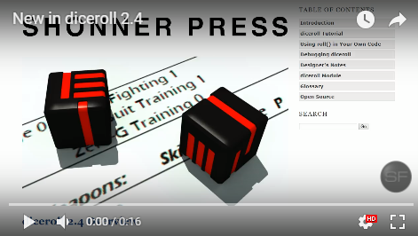

.. figure:: docs/source/pydice_manual_cover_pdf_art.png

**pydice for Python 3.9**
=============================

**pydice** is a Python 3.9 module that your game code calls to make dice rolls.

For instructions on installing and trying out the tutorial, read
the **pydice Operations Manual** at http://pydice.readthedocs.io

Download the PDF from https://readthedocs.org/projects/pydice/downloads/pdf/latest

Warning
-------

**pydice** will not work with **Python 2.7-**.

.. |ss| raw:: html

    <strike>

.. |se| raw:: html

    </strike>

Things To-Do
------------

| Add more dice roll types.
| Make it talk?
| Cheat codes.
|ss|

| Fudge the Fate dice roll a bit.
| Add Advantage and Disadvantage roll types.
| Instruction manual.
| Start on a To-Do.

|se|

**Known History**

* v3.8.0

  From here on, **pydice** is the new name.
  Modified **DEBUG** level logging for **BOON**, **BANE**, **ADVANTAGE**, and **DISADVANTAGE** rolls.
  The new default roll performs a **2D6** roll.
  Added error-trapping when performing **MINMAXAVG** rolls at the CMD prompt.

* v3.7.2

  **MINMAXAVG** calculates negative averages correctly now.

* v3.7.1

  A new secret roll has been added. This is a beta test of the Fate roll type where dice mods can be added.
  As well as number of Fate dice to roll.

* v3.7.0

  **ADVANTAGE** and **DISADVANTAGE** rolls, for d20 systems, are now do-able.

* v3.6.0

  PyDiceroll no longer requires **colorama**.

* v3.5.0

  More than one **D09** can be rolled at a time now.

Contact
-------
Questions? Please contact shawndriscoll@hotmail.com

The Traveller game in all forms is owned by Far
Future Enterprises. Copyright 1977 - 2022 Far Future
Enterprises. Traveller is a registered trademark of Far
Future Enterprises.
